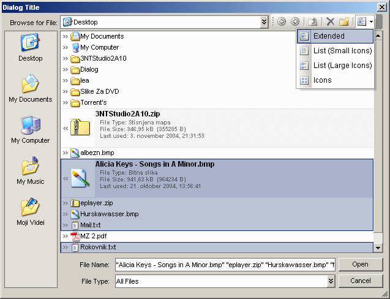



## Custom Dialog Control \- no common controls\! \(look screenshot\)

### Description

A VB.CommonDialog (ShowOpen & ShowSave) replacement control. Written from scratch - fileview etc., uses only standart vb controls - no listview etc. Take a look at the screenshot! Not saying that it is great (has some issues - slownes on older PC's - but as fast as it can be at given concep), but is certanly worth trying! Probably some bugs, since I didn't have a look at the code for months... But nothing serious... I was developing it for more than 6 months (with testing) - it was a part from another (abandoned) project... Send comments... Voite if you like - this is the only way for me to find out how good (or bad) job did I do;) Download and have fun. PS. Oh, sorry commented, but not very well...But should be readable to intermediate users... And not to forget - some of the code (cmemdc.cls, and some bits of code) are from PSC - do not know if there are coments about the who is the author - so if you recognize your code, write here (put a comment) or email me, and you will be pu here on the list... Thanks!!! 

----

Fixed problems with the zip - file was missing

----

Special thanks to:

Vlad Vissoultchev,

Tim Misset,

and many others!
 
### More Info
 

             |
---                |---
**Submitted On**   |2004-11-03 23:28:46
**By**             |[Oricron](https://github.com/Planet-Source-Code/PSCIndex/blob/master/ByAuthor/oricron.md)
**Level**          |Intermediate
**User Rating**    |4.9 (151 globes from 31 users)
**Compatibility**  |VB 6\.0
**Category**       |[Custom Controls/ Forms/  Menus](https://github.com/Planet-Source-Code/PSCIndex/blob/master/ByCategory/custom-controls-forms-menus__1-4.md)
**World**          |[Visual Basic](https://github.com/Planet-Source-Code/PSCIndex/blob/master/ByWorld/visual-basic.md)
**Archive File**   |[Custom\_Dia1813921132004\.zip](https://github.com/Planet-Source-Code/oricron-custom-dialog-control-no-common-controls-look-screenshot__1-57080/archive/master.zip)

